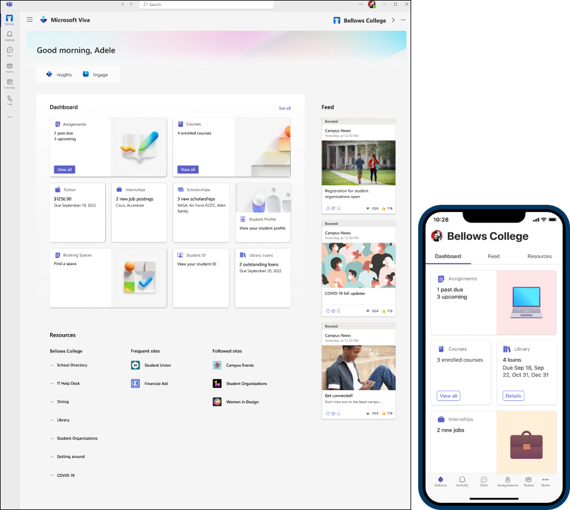
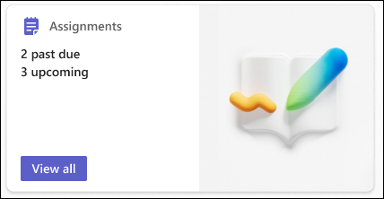
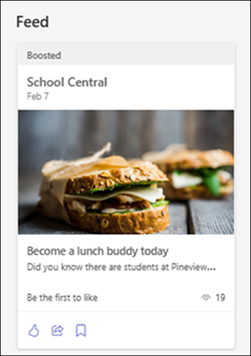
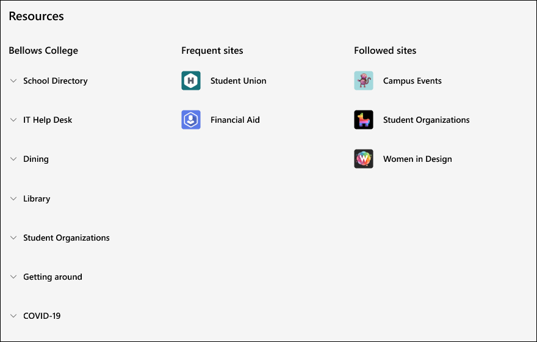
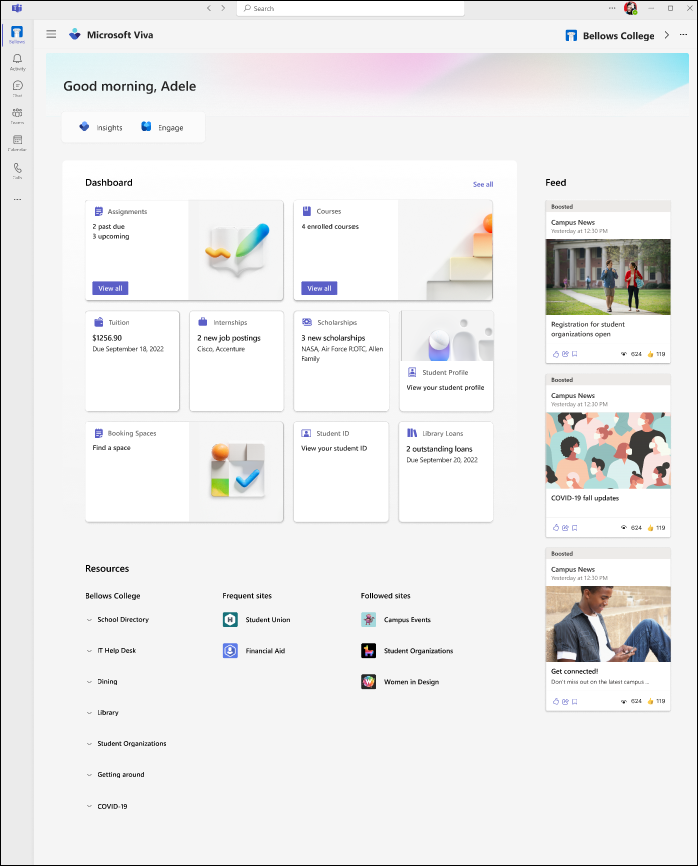
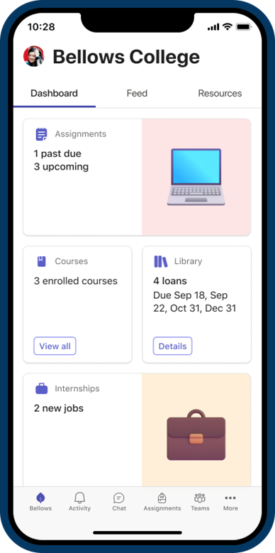
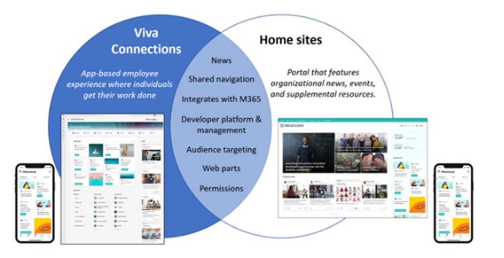

# Overview of Viva Connections for Education

Microsoft Viva Connections for Education is your gateway to a modern faculty, staff and student experience and is designed to keep everyone engaged and informed. It's a customizable app in Microsoft Teams that gives different audiences in your organization a personalized destination to discover other Viva apps your organization is licensed for, relevant news, conversations, and the tools they need to succeed. Viva Connections for Education provides a digital experience for your users allowing them to stay connected with the organization and simplify their day-to-day experience.

Use the [quick guide to set up Viva Connections](set-up-admin-center.md) or get [more detailed guidance on how to plan, build, and launch](/viva/connections/plan-viva-connections).

**Viva Connections is:**

- An education experience app in Microsoft Teams that allows organizations to create unique experiences for different audiences like faculty, staff, students, educators, and researchers.

- A gateway to other Viva apps and services with the ability to curate specific content and tools by providing easy access to resources, tools, relevant news, and popular destinations.

- Built on existing capabilities in Microsoft 365 like SharePoint, Teams, [Viva Engage](/viva/engage/overview) (formerly called Yammer), and Stream.

- Learn more about [Microsoft Viva](https://www.microsoft.com/microsoft-viva) and [Viva licensing](https://www.microsoft.com/microsoft-viva/pricing).

> [!NOTE]
>
> - A SharePoint home site is not a requirement for setting up Viva Connections, but some organizations may choose to use a SharePoint home site in addition to Viva Connections to provide a secondary landing experience that’s more focused on organizational content. **[Learn more about SharePoint home sites and how they complement Viva Connections](/viva/connections/viva-connections-overview#how-sharepoint-home-sites-and-viva-connections-work-together)**.
> - You must have an Academic (A) or Enterprise (E) license type to create a Viva Connections experience. Users with a basic Microsoft 365 subscription (A or E license) are limited to creating one experience. Users are required to have a Microsoft Viva suite or Viva Communications and Communities in order to create two or more experiences (up to ten). See [Microsoft Viva plans and pricing](https://www.microsoft.com/microsoft-viva/pricing) for more info.
> - Viva Connections is not currently supported on tablet devices. Check the **[Microsoft 365 Roadmap](https://www.microsoft.com/microsoft-365/roadmap)** for the status of tablet support.

## Components to Viva Connections

Viva Connections is composed of three primary components - the dashboard, the feed, and resources. Components display slightly differently between desktop and mobile devices.

| Component                  | Description                 |
| :------------------- | :------------------- |
| **Dashboard**                | [The dashboard](create-dashboard.md) is the digital toolset that brings together the resources your users need whether they are on campus, at home, or on the go. The dashboard uses dynamic cards that they can interact with to do things like finding their assessment, their enrolled courses, available internships, accessing training materials, reviewing paystub information, or check and book a shuttle. It can also be used as a [web part on SharePoint home sites](use-dashboard-web-part-on-home-site.md).    Cards in the Viva Connections dashboard are based on [adaptive cards](https://adaptivecards.io/) and the [SharePoint Framework (SPFx)](/sharepoint/dev/spfx/sharepoint-framework-overview). They provide a low-code solution to bring your line-of-business apps into the dashboard. In addition, Viva Connections desktop combined with SharePoint home sites can also be further customized and extended using [SPFx web parts and extensions](/sharepoint/dev/spfx/viva/overview-viva-connections).  |
| **Feed**               | The Viva Connections feed delivers updates to the right people at the right time with powerful targeting and scheduling capabilities. It's tightly integrated with Viva Engage, SharePoint news, and Stream to display a personalized feed, based on post-level targeting of the groups that your users belong to. It supports both centralized organizational communication scenarios and democratized news scenarios. It's available in the Viva Connections Teams app and can also be used on SharePoint sites using the  [Viva Connections feed web part](use-feed-web-part-for-viva-connections.md). |
| **Resources**             | The Viva Connections resources experience enables way finding across popular destinations. It uses navigation elements from the [SharePoint global navigation](sharepoint-app-bar.md) and links can be [audience targeted.](use-audience-targeting-in-viva-connections.md) |

### Viva Connections dashboard

The Viva Connections dashboard enables you to create a curated experience using dashboard cards that give your users access to their most critical content and tools. These cards are designed to enable quick task completion either by interacting with a card directly or by opening a quick view in the dashboard. Think of the Viva Connections dashboard as a digital landing page and toolset for your users.

The Viva Connections dashboard is available on desktop, mobile platforms (iOS, Android), and as a [web part on SharePoint sites](/viva/connections/use-dashboard-web-part-on-home-site). This web part can be integrated into a SharePoint home site, which then is exposed as part of the Viva Connections for desktop experience in Teams.

### Anatomy of a dashboard

A dashboard is made of medium-sized and large-sized cards which users can interact with to get information or complete a task.

**Users can select cards or click the buttons on cards to do things like:**

- Displaying a quick view with more information or an input form

- Navigating to a SharePoint page

- Accessing a Teams app

- Integrate with third party apps and services, including other Viva apps.

Some cards can also reflect dynamic content that refreshes based on a user action or other event. For example, users can see new tasks assigned, assignments to complete, online lectures to join, library books to return or required training courses when they open the dashboard.

The dashboard experience has been designed to be consistent across mobile platform and desktop, but there are some differences:

| Element | Mobile | Desktop |
| :----- | :----- | :----- |
| **Dashboard** | Displays as the default tab in the Viva Connections app in Teams. | It's prominently displayed in the desktop app and can be added to your SharePoint sites as a [web part](/viva/connections/use-dashboard-web-part-on-home-site). |
| **Dashboard layout** | Fixed in portrait mode. Card sizes can be medium (which shows two cards on one row) or large (which shows one card on a row). | Can be portrait or landscape with varying numbers of cards on each row depending on whether the web part is used in a one, two, or  three column page section layout. |
| **Card UI** | Native | HTML based |
| **Card order** | Same as in Desktop | Same as in Mobile |
| **Card reflow** | Same as in Desktop | Same as in Mobile |
| **How many cards are shown** | All cards without audience targeting plus audience-targeted cards where the viewer is part of the targeted audience. | The number of cards to show can be specified in the Dashboard web part settings, but which cards are shown may vary depending on audience targeting. |

### Dashboard authoring

The dashboard can be authored directly in the Viva Connections app in Teams desktop. If you're using a SharePoint home site, the dashboard can also be authored from the SharePoint home site.

The layout of the dashboard, including the size of the cards (which can be individually set as medium or large) can be customized. The layout of the cards may look different depending on whether the dashboard is being viewed on mobile, desktop, or in the dashboard web part.

[Learn more about how to edit your dashboard.](/viva/connections/create-dashboard#edit-the-dashboard)

### Dashboard cards

The Viva Connections dashboard comes with a set of built-in cards, but is also designed to enable SaaS providers, system integrators, and in-house development teams to create their own cards to meet their business needs.

Cards in the Viva Connections Dashboard are based on adaptive cards and the [SharePoint Framework (SPFx)](/sharepoint/dev/spfx/viva/get-started/build-first-sharepoint-adaptive-card-extension). They provide a low-code solution to bring your line-of-business apps into the Dashboard.

> [!NOTE]
> Education tenants have several unique Viva Cards, Teams assignments, and Teams classes.

[Learn more about how to add, remove, and edit dashboard cards](/viva/connections/create-dashboard).

#### Add an Assignments card

1. While in **edit** mode, select **+ Add a card** from the dashboard.
2. Select **Assignments** from the web toolbox.

    

3. In the **property** pane on the right side of the page, select your options.
4. Select a size for the card from the **Card size** drop-down list.
5. Change the **title** if you want to rename the card.
6. If you want to add a custom image, you can under **Custom image**.
7. If you want to target your card to specific audiences (that is, only the audience you specify will see the card in the dashboard), select one or more groups to target. For more information on audience targeting, see [Audience targeting](/viva/connections/create-dashboard#apply-audience-targeting-to-cards).
8. When finished making your selections, close the property pane to apply your changes.

    

#### Add a Courses card

1. While in **edit** mode, select **+ Add a card** from the dashboard.
2. Select **Courses** from the web toolbox.

    

3. In the **property** pane on the right side of the page, select your options.
4. Select a size for the card from the **Card size** drop-down list.
5. Change the **title** if you want to rename the card.
6. If you want to add a custom image, you can under **Custom image**.
7. If you want to target your card to specific audiences (that is, only the audience you specify will see the card in the dashboard), select one or more groups to target. For more information on audience targeting, see [Audience targeting](/viva/connections/create-dashboard#apply-audience-targeting-to-cards).
8. When finished making your selections, close the property pane to apply your changes.

    

### Viva Connections feed

In the Viva Connections app, users will see a personalized feed with relevant information from across their organization.

The feed automatically balances fresh and engaging content with organizational communications to keep users interested, while also ensuring that they see the most important messages. Individual messages can be promoted to raise greater awareness among users by using [SharePoint’s news boost feature](https://support.microsoft.com/office/boost-sharepoint-news-from-organization-news-sites-46ad8dc5-8f3b-4d81-853d-8bbbdd0f9c83) and Viva Engage's (formerly called Yammer) "Featured" options. The feed requires usage of modern SharePoint or Viva Engage communities, but the best experience is delivered when both are used together.

### Feed content sources

Individual content items in the Feed will be displayed for a 30-day period. Users will see content aggregated from the following sources, provided they have permissions to access the content from that source:

- **SharePoint news**
  - News posts from the SharePoint home site
  - News posts from organization news sites
  - News posts from communication and teams’ sites

- **Viva Engage Community Posts**
  - Posts to the organization's community
  - Featured posts.
  - Posts to communities that the user follows.

- **Stream (built on SharePoint)**
  - [Video news links](/viva/connections/video-news-links) on organization news sites
  - Video in a SharePoint news post

Learn more about using the [Feed web part for Viva Connections on SharePoint sites](/viva/connections/use-feed-web-part-for-viva-connections). For information on prioritizing SharePoint news posts in the feed, see [Using SharePoint news boost](https://support.microsoft.com/office/boost-news-from-organization-news-sites-46ad8dc5-8f3b-4d81-853d-8bbbdd0f9c83).

### Viva Connections resources

Resources are the navigational links that are set up and customized from the Teams app, or in the [SharePoint global navigation](/viva/connections/sharepoint-app-bar) for organizations with a [SharePoint home site](/viva/connections/home-site-plan). These resources will be displayed on both the desktop and mobile instances of Viva Connections. Resources include customized navigational links and dynamically generated links to frequent and followed SharePoint sites.

In the mobile app, users can view resources by selecting the **Resources** tab. This type of functioning provides users with a familiar navigation structure and allows them to open sites, pages, news, and more—right from their mobile devices.

## Viva Connections desktop and mobile experience

Both desktop and mobile experiences are centered around three main components: the dashboard, feed, and resources.

### The Viva Connections desktop experience

The desktop experience features the dashboard, feed, and resources at-a-glance, as well as the following key capabilities:

- **Desktop experience**: The new desktop experience of the Viva Connections app plays the role of the main landing page for the suite. It offers easy discovery and navigation to all the Viva modules that the user is licensed for, bringing together the connection, insight, growth, and purpose pillars of Microsoft Viva.

- **Navigation between other Viva experiences**: Navigational elements located in the top-right and top-left corners, navigational elements help viewers easily get to-and-from other landing pages and [other Viva experiences](https://support.microsoft.com/topic/introducing-microsoft-viva-3c1012cb-6c85-4d49-bd7f-b18a6e7873e0).

- **Global navigation and way finding**: The desktop experience provides users the ability to navigate to important resources using the global navigation curated by your organization, the important sites your organization frequently engages with, and with organizational news. This navigation panel appears when users select the branded app icon in Teams, and surfaces elements shared with the [SharePoint global navigation](/viva/connections/sharepoint-app-bar).

- **Access specific tools based on roles**: Throughout the Viva Connections experience, [content can be targeted to specific audiences](/viva/connections/use-audience-targeting-in-viva-connections) to ensure they have the right tools at the right time.

- **Stay updated on news personalized to the viewer**: Users can stay up to date with news, conversations, and videos in a curated news stream based on the sites and communities that they follow.

- **Easily share content**: Content consumed within Teams can be easily shared into chats or channels, making collaboration easier.

### The Viva Connections mobile experience

The mobile experience uses tabs for the dashboard, feed, and resources to make scrolling through content easier.

## Curated and tailored experiences

Viva Connections gives you and your content creators the tools for both curated and tailored experiences. A curated experience is one in which the user sees content chosen by a site owner or author. For example, a site owner controls the content used on the site and whether the content is audience targeted.

> [!NOTE]
> **[Audience targeting](/viva/connections/use-audience-targeting-in-viva-connections)** is accomplished using Microsoft Entra groups for card-level targeting in the dashboard and menu-item targeting in the global navigation.

A tailored experience is one in which content is automatically displayed according to what is most relevant to the users. This content might include content from the sites they follow, their Viva Engage group memberships, popular content, and more. An example of tailored content is the feed.

- **SharePoint home site (curated [optional])**: A SharePoint home site isn't required for Viva Connections, but can be used as a secondary landing destination for organizational content and news. A site owner controls the layout of the SharePoint home site, the elements used on that site, and targeting content to specific audiences.

- **Dashboard (curated)**: A dashboard author controls the curation of the dashboard and can target each card on the dashboard to specific audiences using existing Microsoft Entra groups. These provisions allow dashboard authors to create different experiences for each group. And because Viva Connection uses Microsoft Entra groups, authors benefit from dynamic group memberships to reduce administrative overhead. Authors can easily preview what the dashboard will look like across devices and audiences.

- **Feed (tailored)**: The Viva Connections feed uses its own heuristics to tailor the feed for a user by bringing in the most relevant content for that user. It utilizes signals in the content created across the organization. Some of the signals used are Viva Engage group memberships, sites where news is posted, content popularity, and the intended audiences for a post. The feed also supports promotional capabilities such as using [SharePoint news boost](https://support.microsoft.com/office/boost-news-from-organization-news-sites-46ad8dc5-8f3b-4d81-853d-8bbbdd0f9c83).

- **Resources (curated)**: The list of sites on the resources experience in mobile includes the global navigation defined at the organization level. The global navigation supports Microsoft Entra groups for targeting so that users in different groups will see relevant navigation items.

| Capability name | Curated vs. Mobile | Details |
|-----|-----|-----|
| **SharePoint home site (optional)** | Curated | Organizations with SharePoint home sites  can control the layout, web parts, and audience targeting of content.|
| **Dashboard** | Curated | Author selects cards to show and uses Microsoft Entra groups to [target content to specific audiences.](/viva/connections/use-audience-targeting-in-viva-connections) |
| **Feed** | Tailored | Content is automatically prioritized and displayed based on signals associated with content from SharePoint and [Viva Engage](/viva/engage/overview). |
| **Resources** | Curated | Target menu items in the global navigation to specific audiences by using Microsoft Entra groups. |

## Branding

Matching your organizational brand is integral to your students, faculty, and staff’s connection with your organization. The branding you apply in Teams to the Viva Connections app – including your logo and colors – is automatically applied to the mobile app. For information on how to apply your branding in an app, review [how to customize apps in Microsoft Teams](/microsoftteams/customize-apps). The desktop app offers an opportunity for further branding by [customizing the banner image](/viva/connections/edit-viva-home#customize-the-banner-image).

## Localization

Viva Connections is available in most major languages used in Microsoft 365. Learn more about [how to set up the Viva Connections mobile experience in a specific language](/viva/connections/viva-connections-language) and [how to create a dashboard in more than one language](/viva/connections/create-multilingual-dashboard).

- **Dashboard**: Content can be set by dashboard authors to support multiple languages.

- **Feed**: The content will be available in the format in which it was authored, and SharePoint news posts will display author-translated posts in the user’s preferred language.

- **Resources**: Are linked to the global navigation experience and follows the tenant’s default language.

## Extensibility

Many components to the Viva Connections experience can be customized. The [SharePoint Framework](/sharepoint/dev/spfx/sharepoint-framework-overview) (SPFx) is the recommended SharePoint customization and extensibility model for developers because of the tight integration between SharePoint Online, Microsoft Teams, and Microsoft Viva Connections. The SPFx is the only extensibility and customization option for Viva Connections. [Learn more about Viva Connections extensibility](/sharepoint/dev/spfx/viva/overview-viva-connections).

## How SharePoint home sites and Viva Connections work together

Viva Connections and SharePoint home sites are two complementary methods to creating powerful student, faculty, and staff experiences that can be viewed on the web and in Teams. A [SharePoint home site](/viva/connections/home-site-plan) is a user experience that serves as a landing destination, news hub, and the main entry-point to your organization’s intranet. Both Viva Connections and SharePoint home site experiences are designed to unite and empower your organization and automatically integrate with each other to form a cohesive and branded experience.

Use Viva Connections as the primary destination where your users access role-specific tools and news and SharePoint home sites as a secondary source of organizational news, events, and resources. Viva Connections is where individuals get access to curated content based on their role, and the SharePoint home site is where they can find more organizational-focused resources.

### Shared functionality

Viva Connections and SharePoint home sites share many common capabilities like news roll ups, navigation, and third-party extensibility to ensure these solutions work together. Both types of experiences share basic functionality, like the ability to use audience targeting, distribute organizational news, and [share the same permissions model](/viva/connections/edit-viva-home) to make it easy for editors to access and manage.

### Viva Connections automatically detects SharePoint home sites

For organizations that already have a SharePoint home site, or know they want one in the future, the SharePoint home site is automatically detected by Viva Connections, and a prominent link will display at the top-right of the desktop experience. Users can easily navigate between both – so you don’t have to choose one over the other.

### Choose the default landing experience

Unless specified, Viva Connections is the default experience for the desktop app in Teams. When Viva Connections is the default, a link to the SharePoint home site will display in the top-right corner to ensure easy navigation between the two experiences. We recognize that some organizations with a SharePoint home site want it to be the default experience. When the SharePoint home site is the default experience, a link to Viva Connections will display in the top-right corner. [Learn more about choosing the default experience](/viva/connections/edit-viva-home#choose-the-default-landing-experience-for-viva-connections-desktop).

### Step-by-step guidance to provision Viva Connections

There are several options to learn more about how to get Viva Connections for your organization.

| Option | Description | Time to complete |
|-----|-----|-----|
| **[Quick guide](set-up-admin-center.md)** | Use the quick guide to get a high-level overview of how to get Viva Connections | 10 minutes |
| **[Plan, build, and launch guidance](/viva/connections/viva-connections-setup-overview)** | Get more detailed guidance that focus on tasks in the plan, build, and launch phases. | 30 minutes |
| **[Learning path](/training/paths/viva-connections-get-started/)** | Get in-depth guidance that includes fictitious business stories and examples. Complete knowledge checks to confirm learnings. | Two hours |
>

## More resources

[Learn how to plan, build, and launch a SharePoint home site](/viva/connections/home-site-plan)

[Viva Connections adoption resources](https://adoption.microsoft.com/viva/)

[Viva Connections guidance for end users](https://support.microsoft.com/office/your-intranet-is-now-in-microsoft-teams-8b4e7f76-f305-49a9-b6d2-09378476f95b)

Learn more about [add, remove, and edit dashboard cards](/viva/connections/create-dashboard)

Discover [more card options from third-party services](https://cloudpartners.transform.microsoft.com/resources/viva-app-integration)

[Frequently asked questions about the feed](/viva/connections/faqs-viva-connections-feed)

Prioritize SharePoint news posts in the Feed by [using SharePoint news boost](https://support.microsoft.com/office/boost-news-from-organization-news-sites-46ad8dc5-8f3b-4d81-853d-8bbbdd0f9c83)

Use the [Feed web part for Viva Connections on SharePoint sites](/viva/connections/use-feed-web-part-for-viva-connections)
