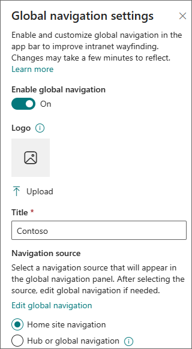
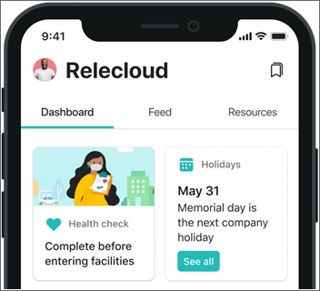

# Set up the Viva Connections experience in a specific language

Viva Connections is available in most major languages used in Microsoft 365. Learn more about how to create and deploy the Viva Connections mobile experience in a specific language other than your organization’s default language. 

> [!NOTE]
> Teams and SharePoint may individually support more languages than the ones below.

## Available languages

:::row:::
   :::column span="1":::
      English  
      Japanese  
      German  
      Chinese (Simplified)  
      Spanish  
      French  
      Portuguese (Brazil)  
      Russian  
      Italian  
      
   :::column-end:::
   :::column span="":::
      Chinese (Traditional)  
      Korean  
      Dutch  
      Polish  
      Swedish  
      Turkish  
      Czech  
      Portuguese (Portugal)  
      Thai  

   :::column-end:::
   :::column span="":::
      Danish  
      Hungarian  
      Finnish  
      Indonesian  
      Greek  
      Romanian  
      Ukrainian  
      Catalan  
      Norwegian Bokmål  

   :::column-end:::
:::row-end:::

Broadly, [Viva Connections](viva-connections-overview.md) has four components that influence the end user’s overall language experience - the Viva Connections dashboard, feed, resources, and the Teams mobile app. Learn how to set up Viva Connections components to display content in another language other than your organization’s default language. The steps below use English as an example, but the steps apply for any one of the 27 languages specified above.

## Viva Connections dashboard

The dashboard is intended to enable quick access to content and tasks from various sources including intranet content, line-of-business applications, HR tools, frontline worker tools, and other internal or third-party applications.

### For organizations using an intranet portal (SharePoint home site)

> [!NOTE]
> The latest release of Viva Connections doesn't require you to have a home site. [Learn how to choose a dashboard language without a home site](#for-organizations-using-just-viva-connections).

1. Create a communication site and make sure to select English as the default language at site creation time.

   

2. [Create a Viva Connections experience](set-up-admin-center.md#build-from-an-existing-intranet-portal) using this site as your existing intranet portal.

3. When creating the dashboard, make sure the dashboard author is typing the content in the English language for details like card titles and descriptions – [even if their own preferred language setting](https://support.microsoft.com/office/change-your-personal-language-and-region-settings-caa1fccc-bcdb-42f3-9e5b-45957647ffd7) in Microsoft 365 is not English.

4. Then, you can [create dashboards in more than one language](create-multilingual-dashboard.md) using the SharePoint multilingual feature.

> [!NOTE]
> For [custom cards on the dashboard](/sharepoint/dev/spfx/web-parts/guidance/localize-web-parts), ask your card developer to include content localized in English language.

### For organizations using just Viva Connections

1. Navigate to the Viva Connections app in Teams.
1. Select **Edit** in the dashboard section.
1. Then select **Dashboard details**.
1. [Create dashboards in more than one language](create-multilingual-dashboard.md) using the SharePoint multilingual feature.
1. Copy the link to the dashboard under **Properties > Name**.
1. Paste the link in a browser. Then go to **Settings > Advanced site settings > Language preferences**.

## Viva Connections Feed
The Feed experience will display SharePoint news posted from [organizational news sites](/sharepoint/organization-news-site), sites you frequent and follow, [videos hosted on SharePoint](video-news-links.md), Viva Engage posts in the [All-company group](/viva/engage/manage-viva-engage-groups/viva-engage-all-company-viva-engage-community), Viva Engage posts in communities you follow, and [SharePoint news that has been boosted](https://support.microsoft.com/office/boost-news-from-organization-news-sites-46ad8dc5-8f3b-4d81-853d-8bbbdd0f9c83). 

### Organizational news

Make sure that authoritative news sites (there can be more than one organization news site) are created with English as the default language and that authors of news post are creating the news posts in English language – even if their own [preferred language setting in Microsoft 365](https://support.microsoft.com/office/change-your-personal-language-and-region-settings-caa1fccc-bcdb-42f3-9e5b-45957647ffd7) is not English. In order for content in the feed to display in a language other than your organization’s default language, [SharePoint news posts will need to be available in more than one language](https://support.microsoft.com/office/create-multilingual-communication-sites-pages-and-news-2bb7d610-5453-41c6-a0e8-6f40b3ed750c).

#### All company Viva Engage
Announcement posts in the [All-company group in Viva Engage](/viva/engage/manage-viva-engage-groups/viva-engage-all-company-viva-engage-community) should be created in English.

## Viva Connections resources

The resources experience displays intranet resources from [global navigation in the SharePoint app bar](sharepoint-app-bar.md) and can be configured from the home site.

> [!NOTE]
> Global navigation and a dashbaord can only be enabled and customized from the [home site](home-site-plan.md) and required site owner (or higher) permissions. The default language of that site should already be English.

1. Navigate to the **Settings** panel from the home site and select **Global navigation**.
2. The global navigation **Title** should be in English.
3. The navigational node in the global navigation must be entered in English.

   

4. After navigational nodes have been set up for the first time in English, [enable multilingual functionality, select languages, and translators](https://support.microsoft.com/office/create-multilingual-communication-sites-pages-and-news-2bb7d610-5453-41c6-a0e8-6f40b3ed750c#bkmk_enable). Follow guidance for creating copies of a site that can be translated and published for viewers with a preferred language that's different from the default language.

## Microsoft Teams mobile app

In the Teams mobile app, Viva Connections is displayed as another tab in the Teams app bar. The language experience of the mobile app is driven by the device language set by the user. Make sure to inform your users to set it to English for a cohesive experience – although it is not required.

If a user has a device set to the French language the Teams mobile app “system” strings (text that Microsoft provides out-of-the box for end-user experience in the app) will all be in French while the dashboard cards, feed, and resources content will be in English.

## More resources

[Overview of Viva Connections](viva-connections-overview.md)

[Set up a Dashboard in more than one language](create-multilingual-dashboard.md)
