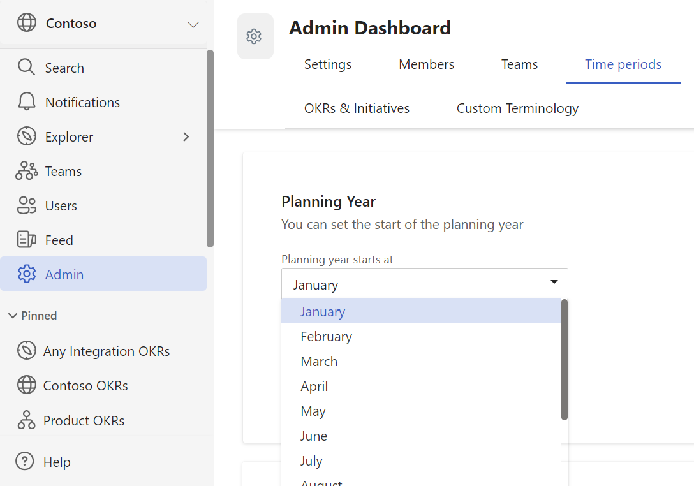
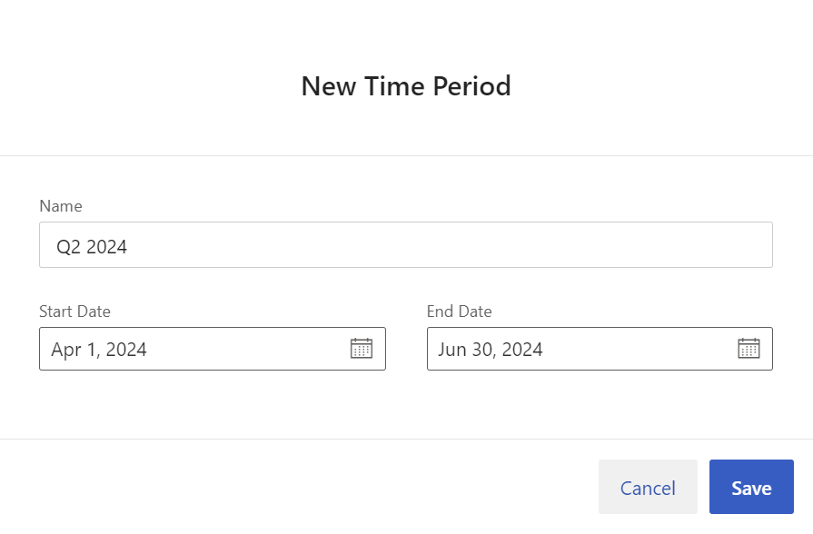
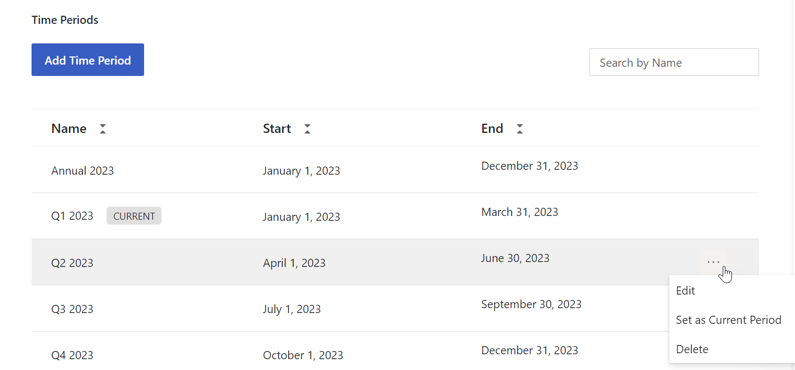

# Manage OKR time periods in Viva Goals

## Time periods in Viva Goals

Viva Goals comes with both annual and quarterly time periods. Typically, organizations operate on an annual planning cadence and departments/teams operate on a quarterly planning cadence.

The *current time period* is the time period under which all current OKR activity is logged. When a new quarter begins, Viva Goals automatically sets the current time period for everyone in your organization to the new quarter. This change is visible to all users.

The Viva Goals administrator for your organization can manage OKR time periods and customize them for your org's needs. For instance, instead of using the default quarterly periods, you might have monthly periods, or even custom periods.

If you use a custom time period, Viva Goals will no longer automatically update the current time period. Instead, you will manually update the current period at your discretion.

## Manage time periods

### Change the start of your planning year

1. Go to **Admin** > **Time periods**.

1. Under **Planning Year**, select **Change**.

1. Choose an option from the dropdown. The start of the planning year is set to January by default.

### Add a time period

1. Go to **Admin** > **Time periods**.

1. In the **Time Periods** section of the **Time periods** page, select **Add Time Period**.

    

1. Give your time period a name, a start date, and an end date.

1. Select **Save**.

    

### Edit or delete a time period

1. Go to **Admin** > **Time periods**.

1. In the **Time Periods** section of the **Time periods** page, find the time period you want to modify and select **More options** (the three dots).

1. Select **Edit** or **Delete**.

### Set a time period as the current time period

1. Go to **Admin** > **Time periods**.

1. In the **Time Periods** section of the **Time periods** page, find the time period you want to set as the current time period and select **More options** (the three dots).

1. Select **Set as Current Period**.

## Frequently asked questions

### When are the time periods for my next planning year created?

The time periods for the next planning year (annual and quarterly) are automatically created on the first day of the fourth quarter (Q4) of your current planning year.

If you start planning your next year's OKRs before Q4, you can [add that year's time periods](#add-a-time-period) in advance.

### Why doesn't my current time period automatically switch over after the last day of the period?

If an administrator adds custom time periods, Viva Goals will no longer automatically update the current time period. Users need to change the current time period manually.
