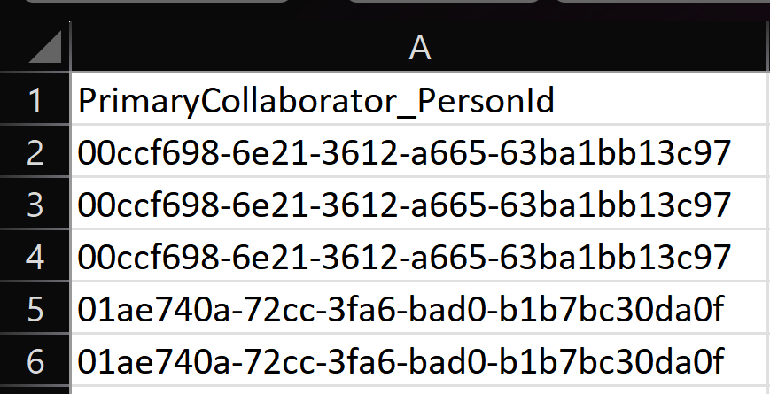
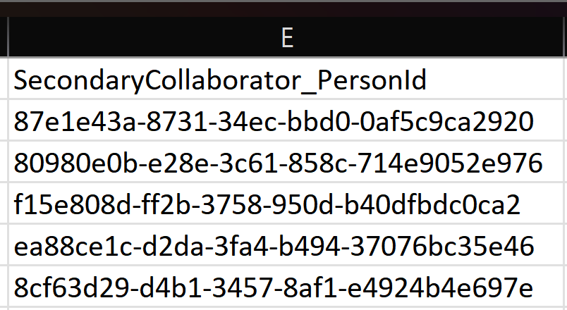

# Collaboration between individuals (person-to-person)

Successful employees and teams use collaboration networks to get work done effectively. Measuring descriptive information about these networks tells you how well employees can access their network’s resources. When you select **Collaboration between individuals** to run a person-to-person query, you’ll analyze how strongly and diversely employees collaborate with others in your organization.

## About strong and diverse ties

Some network connections represent significantly closer collaboration than a reciprocal interaction. When a network connection represents significantly closer collaboration time compared to other reciprocal interactions, Viva Insights classifies it as either a strong tie or as a diverse tie.
 
The difference between strong ties and diverse ties is determined by how many other network connections the two individuals have in common.
If two people have had a reciprocal interaction in the last four weeks, and also have many network connections in common, Viva Insights considers their connection a strong tie. Strong ties typically indicate that people work in the same group or team. Groups of employees with many strong ties are usually highly cohesive units.

If two people have had a reciprocal interaction in the last four weeks, and also have few network connections in common, Viva Insights considers their connection a diverse tie. Although these two people work closely with each other, they don’t typically operate in the same circles. Groups of employees with many diverse ties often have high innovative potential, because they’re exposed to lots of information outside of their shared context.

## How to run a person-to-person query 

### Set up your query

1.	In the advanced insights app’s **Analysis** page, go to the **Custom queries** section, find **Cross-collaboration query**, and select **Start analysis**.
1.	Name your query (optional). Queries are assigned a default name, which follows this format: "CrossCollaborationQuery," user ID, date, and time. Make sure the name is unique.
3.	Select a **Time period** (optional). This field defaults to Last 3 months, but you can select another. Pick from **Last 1 year**, **Last 6 months**, **Last 1 month**, or a **Custom date range**. If you choose a Custom date range, use the date picker to select the range.  
4.	Optional: Set the query to automatically update by selecting the **auto-refrehs** box. When you turn on the auto-refresh option, your query automatically runs and computes a new result every month. This option is turned off by default, but you can use it on any query where the **Time period** isn’t customized. 
5.	Optional: Type a **Description**.
6.	Optional: To change which metric rule your query uses, select **More Settings** beneath the **Description** box. To find out more about each rule, select **View rule**.

### Add metrics, filters, and employee attributes

1.	Under **Add metrics**, select the **Add metrics button**, then pick metrics from the **Select metrics** pane. For person-to-person queries, you’ll choose from network person-to-person metrics, which are:
    * Diverse tie score
    * Diverse tie type
    * Strong tie score
    * Strong tie type
 
When you're done picking metrics, select Add to query.

1. Under **Select filters**, select which employees you want your query to apply to. You’ll need to set two filters here: one for your primary collaborators—that is, those whose collaboration patterns are at the center of your analysis—and the other your secondary collaborators—that is, those who work with your primary collaborators. 
    >[!Tip]
    Need more information about collaborators? Learn about primary and secondary collaborators, and how to choose them, [here](collaborators.md)

1.	Under **Organizational data**, select the attributes—or descriptive pieces of information about employees—that you want to appear in the results along with the metrics you picked in step 1. You can use these attributes to further summarize your results—for example, create analyses that compare and contrast the collaboration of different groups in your organization.

### Run your query

After you’ve set up your query, you’re ready to run it. In the screen’s upper right, select Run.

## About query results

### How to access your results

After you run your query, go to the **Query results** page to check your query’s status. When your query is ready, a green checkmark appears under the **Status** column.

To download your results as a .csv file, select the CSV icon under the **Downloads** column. You can also get a direct link to your query to use elsewhere, like Power BI, by selecting the link icon.

### What your results show

Your query results show the quality of the relationship between two specific, but de-identified, people. Each row shows information for a pair of people who had a strong or diverse tie during query’s time period.

Here’s how columns will appear in your results file:

The first column identifies the primary collaborator in the pair by providing a de-identified ID number. This column appears automatically and is titled **PrimaryCollaborator_PersonId**. 

 
The next columns describe the primary collaborator. The column names for these attributes are the organizational attributes you selected while you built the query, with the prefix **PrimaryCollaborator_**. In the graphic below, the analyst selected **FunctionType**, **LevelDesignation**, and **Organization** as their attributes:

 
The following column identifies the secondary collaborator in the pair. Like the first column in the file, this column appears automatically, is titled **SecondaryCollaborator_PersonId**, and provides a de-identified ID number to represent the secondary collaborator.

 
Like for primary collaborators, the next columns describe the secondary collaborator by providing the attributes you picked earlier. The columns include the attribute names, with the prefix **SecondaryCollaborator_**. Here’s how these columns would appear if the analyst selected **FunctionType**, **LevelDesignation**, and **Organization** as their attributes:

 
The last columns in the file give you the metric date and results—that is, scores and types—for the metrics you selected.
The **MetricDate** column shows the start date of the aggregated output. This date will be the first day of the month that your data covers. The following columns show values for the metrics you added when you built the query. 
 
