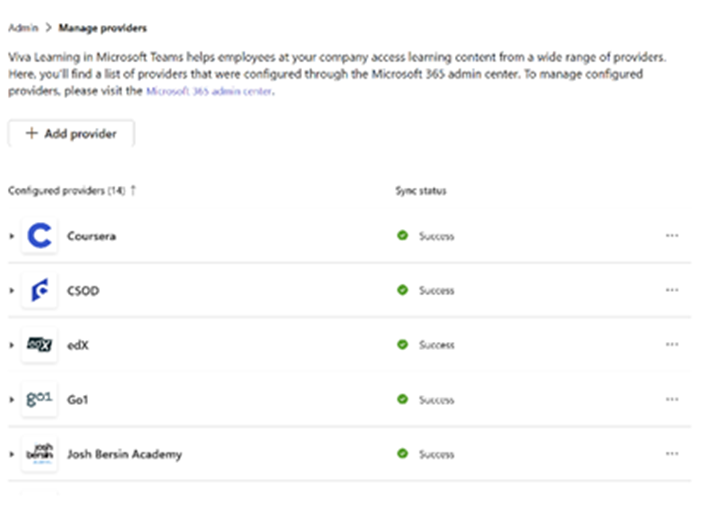
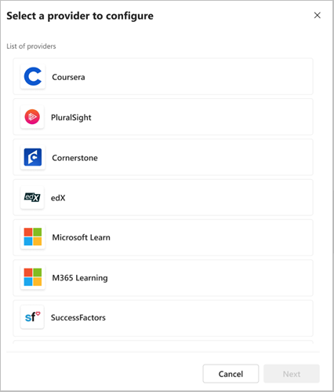
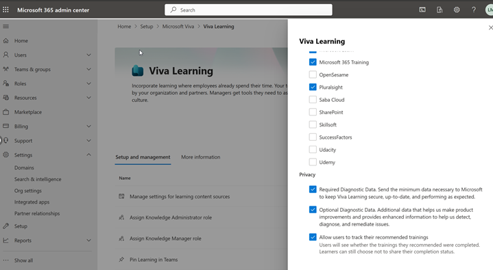

# Manage content sources for Viva Learning 

The administrators for the Microsoft 365 admin center—either by themselves or by assigning the knowledge admin role to selected individuals in your organization—can manage settings related to Viva Learning and can configure the learning content sources.

The administrator selects which other learning content sources (for example, SharePoint or supported third-party content provider sources) will be available to users of Viva Learning. The admin then configures those sources to make sure the content is available for search and discovery and can be browsed by the employees who use Viva Learning. Content from Microsoft Learn, Microsoft 365 Training, and select content from LinkedIn Learning is available for free and enabled by default. If your organization has a LinkedIn Learning Enterprise subscription, employees can access the entire LinkedIn Learning catalog in Viva Learning without a Viva Suite or Viva Learning license.

>[!NOTE]
>Content accessible through Viva Learning is subject to terms other than the Microsoft Product Terms. Content and any associated services are subject to the content provider's privacy and service terms.

> [!NOTE]
> For non-Microsoft content (except free LinkedIn content), ensure your organization has a subscription for your users to access that content using a work account before connecting it to Viva Learning. Users' personal subscriptions to non-Microsoft learning providers will not be integrated with Viva Learning. Users sign in to non-Microsoft and LinkedIn Learning Pro learnings in a browser or embedded viewer. This configured learning is subject to the separate license, privacy and service terms between your organization and the third party, and not the Viva Learning terms. Before selecting this type of learning, verify you have an agreement in place for your organization and users. If users navigate to content where they do not have an organizational subscription, they may see a provider page where they could sign up for an individual subscription. All non-Microsoft learning is provided under the non-Microsoft provider's terms and not as part of Viva Learning.

## Assign the knowledge admin role (Optional)

You must be a Microsoft 365 global administrator to perform these tasks.

> [!TIP]
> The knowledge admin should be moderately technical and have existing SharePoint admin credentials, preferably someone who is well-versed in the education, learning, training, or employee experience part of the organization.

### Add a knowledge admin

To add a knowledge admin for Viva Learning, follow these steps:

1. In the left navigation of the Microsoft 365 admin center, go to **Roles** and select **Role assignments**.

    

2. On the **Role Assignments** page, on the **Microsoft Entra ID** tab, select **Knowledge Administrator**.

    

3. On the **Knowledge Administrator** panel, select **Assigned admins**, and then select **Add**.

    

4. On the **Add admins** panel, select the person you choose for the role, and then select **Add**.

### Remove a knowledge admin

To remove a knowledge admin for Viva Learning, follow these steps:

1. In the left navigation of the Microsoft 365 admin center, go to **Roles**, and select **Role assignments**.

    

2. On the **Role assignments** page, go to the **Microsoft Entra ID** tab, and then select **Knowledge Administrator**.

    

3. On the **Knowledge Administrator** panel, on the **Assigned Admins** tab, select **Remove**, and then select the person you want to remove from the role. To confirm, select **Remove**.

    

## Configure settings for the learning content sources

You must be a Microsoft 365 global administrator or knowledge admin to perform these tasks.

To configure settings for learning content sources in Viva Learning:

1. Go to the **Admin** tab in Viva Learning and select **Manage Providers** on the left menu.

2. Select **Add Provider**  

    

3. Select the provider you want to configure from the Provider list and select **Next**.

    

4. Enter the configuration details and select **Save**. These details vary depending on the provider.

5. Once the configuration is saved, the provider displays on the **Manage Providers** dashboard of the tenant.

6. The start of the sync indicates a successful configuration. You can refer to the sync status for more details.

7. To edit or delete the already configured provider, select **Edit** or **Delete** from the provider menu.

    

> [!NOTE]
> You'll need a Viva Learning or Viva Suite license to connect external content sources, with the exception of LinkedIn Learning. You'll need a LinkedIn Learning Enterprise subscription to access LinkedIn Learning content other than the select free courses. [Learn more about licensing](https://www.microsoft.com/microsoft-viva/learning).

Some learning content sources are enabled by default. These learning sources include:

- LinkedIn Learning selects free content
- Microsoft Learn
- Microsoft 365 Training
- Bring your own content

## Add link to content

> [!NOTE]
> A Viva Suite or Viva Learning license is required to add link to content and to consume this content.
> This content isn't searchable in Viva Learning.

### Add link to content in learning collections

Employees can now add link to learning content stored in your organization's internal sources, such as the SharePoint library or Microsoft Stream, or online sources such as YouTube, or Vimeo. 

The web links on the domains & addresses and URLs blocked under Tenant Allow/Block List can't be added. Review the [Microsoft security home page](https://security.microsoft.com/homepage).

Addition of online content can be disabled for the employees. Employees can, however, add content from the organization's internal sources, such as SharePoint or Microsoft Stream.

1. Go to the **Admin** tab.

2. Go to **Settings**.

3. Toggle on to allow users to add web links, or toggle off to disable.  

4. Add link to content in the Viva Learning tabs.

### Add link to content in Viva Learning tabs

To allow users in your organization to add link to content store in SharePoint into Viva Learning tabs:

1. In the left navigation of the Microsoft 365 admin center, go to **Settings**, then **Org settings**. 

2. On the **Org settings** page, on the **Services** tab, select **Viva Learning**. 

3. Check the box to enable and uncheck the box to disable the addition of links. 

## More app settings

You can control the Viva Learning availability in your org from Teams Admin center.

To control the ability to bring your own content or privacy related settings go to the Viva Learning settings page on the Microsoft 365 admin center.
You can also search for Viva Learning landing page on Microsoft 365 admin center to get a comprehensive list of all the Viva Learning settings.

## Enable tracking of recommended content

Users can recommend content to each other in Viva Learning. Enable tracking to allow a recommender to set due dates and track the progress of content they recommended. Tracking is enabled by default.

1. In the left navigation of the Microsoft 365 admin center, go to **Settings** > **Org settings**.

2. On the **Org settings** page, on the **Services** tab, select **Viva Learning**.

3. Check the box to enable tracking, or uncheck the box to disable tracking.

    

## Next step

[Add SharePoint as a content source for Microsoft Viva Learning](configure-sharepoint-content-source.md)

[Manage Providers](use-tabs.md)
