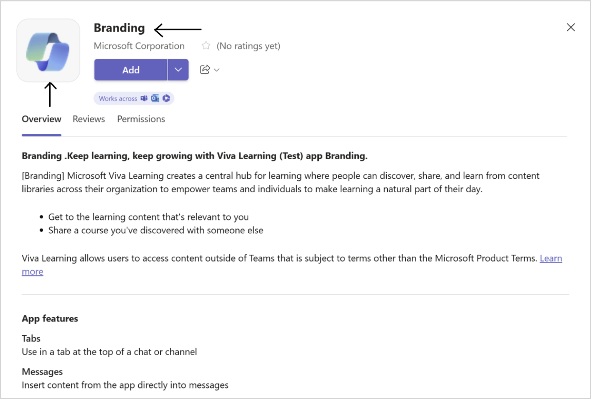
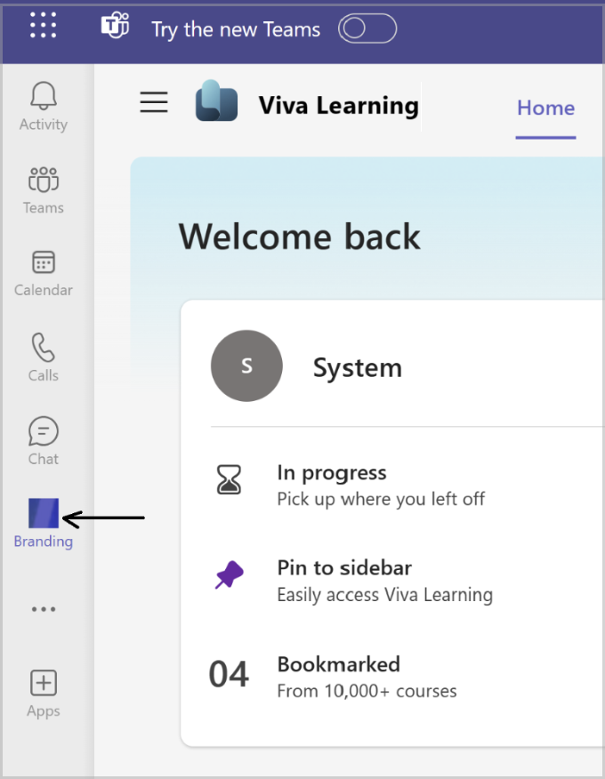

# Customize your Viva Learning experience 

You can customize your Viva Learning experience to fit your organization’s brand and the needs of your employees. 
Your organization’s Viva Learning app can display a custom Viva Learning icon and label in the Teams app bar. This customization takes place in the Teams admin center and requires the Teams admin permissions or higher.

We recommended that you also apply app settings that [pre-pin and preinstall the app](/microsoftteams/teams-app-setup-policies) to make sure people in your organization can more easily discover and use it.

You can customize the Viva Learning application by following the instructions as outlined in the [Microsoft Teams app customization documentation](/microsoftteams/customize-apps#considerations-and-limitations-of-app-customization).

| Customizable field | Consideration |  
|-----|------------|
| Short name | Application name as mentioned in Teams menu bar.|
| Short description | The short description must be under 80 characters.   Don't repeat what's in the full description. |
| Icon | Transparent outline icon in PNG format that   is 32x32 pixel in resolution. |
| Color icon | Full-color icon in PNG format that is 192x192   pixel in resolution. |
| Accent color | Color must match your icon background. |

Any URL fields on the application manifest can't be edited. Viva Learning application settings can be [reset to default](/microsoftteams/customize-apps#reset-app-details-to-default-values).
Teams app branding changes using manifest have [limitations](/microsoftteams/customize-apps#considerations-and-limitations-of-app-customization).

## Considerations

The new name and new icon display in the following cases:

- The application in the App Store
- When the app is pinned on Teams.
- In the Microsoft Teams notification.
- In the composed extension header pop ups and in the chat message generated by the composed extension.
- In the courses unfurl experience in chat (on Share).

The scope for these changes uses only the Teams manifest and applies to all users in the tenant. No customization can be done at a department or group level.

The Viva Learning app in the App Store displays with the new short name and icon (color icon):

The new short name and the outline icon display in the Teams left menu bar when you pin the app: 

## Limitations

- The new app icon and app name won't display in Viva interconnections.
- The application header won't be changed in either desktop, web, or mobile.
- The new app icon or app name won't display in the global navigation.
- The Viva Learning web app won't reflect any of these branding chances as our current scope is the Teams application manifest.
