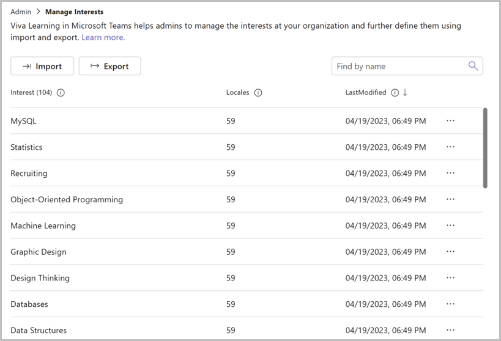
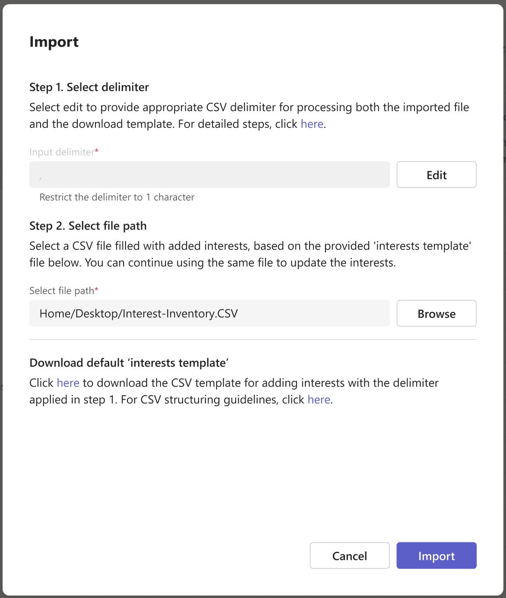
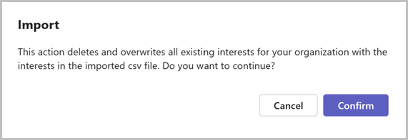

# Manage Interests in Viva Learning

## Prerequisites

The following roles have access to **Manage Interests**:

- Knowledge admin
- Knowledge manager  
- Global administrator

You can also manage access to reports through Microsoft 365 groups. [Learn more](/viva/learning/feature-access-management).

Interest-based learning personalizations let admins curate interests they want their organization to develop or manage interests based on existing library in the learning management system.

Manage interests is a premium feature available for premium Viva Learning tenants.

With interests, you can enable learners with access and opportunities to get content recommendation for interests from the extended tenant's list. 

> [!NOTE]
> All Viva Learning users will be able to browse, search, and select interests which have been curated by admin from their home page.

## Manage interests

Admins can curate or extend the interests for the tenant and enable learners with more access and opportunities to get content recommendations from interests they want to learn.

>[!NOTE]
>Before importing your library, export the current interests by selecting **Export** and keep it for your reference.

1. Navigate to **Admin** tab.

2. Select **Manage Interests**.

    

3. You see that the existing default interests are already displayed in this view.
  
4. Select **Import** to extend or curate interests for your tenant.
    1. Select a CSV delimiter to process both the imported file and the download template. If the delimiter in your CSV file is `;` then provide `;` in the input delimiter field
    2. Select a CSV file path that contains added interests from the interests template file in step 5.

    

   > [!NOTE]
   > To find out what is the delimiter used, open the CSV file in notepad. The delimiter is the separator used in the file, such as `,` or `;`.
   > While importing the CSV file, provide the same delimiter, so that Viva Learning can use the same delimiter while processing the imported file.

5. **Download** the Viva Learning template file for interests and provide your library in this template.

    1. The Viva Learning Template file is a CSV file with the following details: 
    - **Row 1**: 
        - `externalCode` - a mandatory GUID column for importing each record. You can provide any unique value for each record and apply your existing IDs of respective interests in your system. 

        - `Interest name` - a column for each of the Viva Learning supported language (such as “Name.en_US” to provide interest name in English). You must provide an Interest name for each record in at least one language and remaining can be optional.

        - `Interest description` - a column for each of the Viva Learning supported language (such as “Description.en_US” to provide description in English). Description is optional for all languages. 

    - **Row 2:** Provides details for each column by elaborating the Language name. Processing of interests happens from row 3, so you can keep the first two rows in your modified file as well.  

    - **Rows 3, 4, and 5**: Sample interests with sample external code, interest name and interest description in English. These records are provided just for your reference, and you can remove these records. 
    
   >[!NOTE]
   > Add minimum of 20 interests with unique external code and interest name in at least one language for the file to be imported and processed. 
   > You can rearrange the order of columns as per your convenience. 

   

   You see an indication that the uploaded file is a valid CSV file. 

1. Select **Import**.

   

1. **Confirm** that any interests, which are in your current interests and not part of the imported file will be deleted:

    - You receive a notification on the screen indicating that the file has been imported at the provided timestamp and is being processed.
    
    - The processing can take between 20 minutes to a couple of hours based on the number of interests. You can switch between different Viva Learning admin pages and then select **Manage Interests** to see the updated notification message on the number of items successfully processed, deleted, updated, unchanged, and failed.

   If some interests can't be imported, you see a failure count and can get more details on these failures by downloading the log file.

Select **Download Log** for data on the current interests with the columns available in the Viva Learning template file. There are two more columns **Status** and **Comments** that gives details on the status for each record and the error details in the comments section. The download log file will also display the interests, which have been deleted.

The **Manage Interests** view displays a pagination of interests with interest name, locales (the number languages a particular interest is available in) and the last modified time stamp.

You can sort the view through any of these three columns. You can also view more details for each interest by clicking on the three dots (…) for a specific interest.

Select **View Details**, which outlines interest name, interest description and details of the number of languages a particular interest is available in.

## Export interests

1. In **Manage Interests**, select **Export** to export the interests available for your organization.

1. Select **Confirm**.
    - You receive a notification indicating that the file has been exported at the provided timestamp and is being processed.
    - The processing takes between 20 minutes to a couple of hours based on the number of interests. You can switch between different Viva Learning admin pages and then refer to **Manage Interests** to see the update that the processing is complete.

1. Select **Download** to download the exported interests.

> [!NOTE]
> If you open the exported file and see all data in one column, see [Managing exported interest inventory files](interests-troubleshooting.md).

## Language support for Manage Interests

**Manage Interests** prioritizes the display of interest names and descriptions in the language of the user's Teams app.  

For example:  
- If the admin has their Teams app language set to French, then they see the interest name and description in French if it's available in that locale.

- If a particular interest isn't available in the French locale, then that particular interest displays in tenant default language. 

- If a particular interest isn't available in French or tenant default language, then that interest displays in a language in which it's available.

>[!NOTE]  
> Regardless of the default language of the admin's Teams app, the admin will always see all the interests available for your organization.

