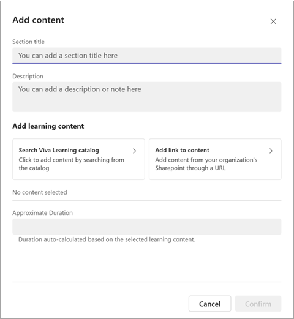
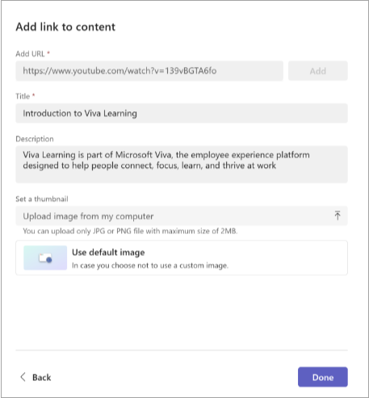

# Add link to content in Learning Paths 

You can add link to content found in SharePoint, YouTube, Vimeo, news articles, and other sources into Viva Learning. Content can be bookmarked, recommended, and shared. 

> [!NOTE]
> You need a Viva Suite or Viva Learning license to add link to content.   
> This content isn't searchable in Viva Learning. 
> The default language for this content is the one set by your organization's admin.  

1. Create a [learning path](creating-learning-paths.md). 

2. Select **Add content** to add courses to your learning path.

3. Select **Add link to content**.

    

 
4. Paste the SharePoint URL or web link. Select **Add**.

    

5. Edit the title, thumbnail, and description.

6. Select **Done**. 

7. To edit content, go to the section and select the pencil icon. 

8. To delete content, go to the section, edit and select the cross.

    

