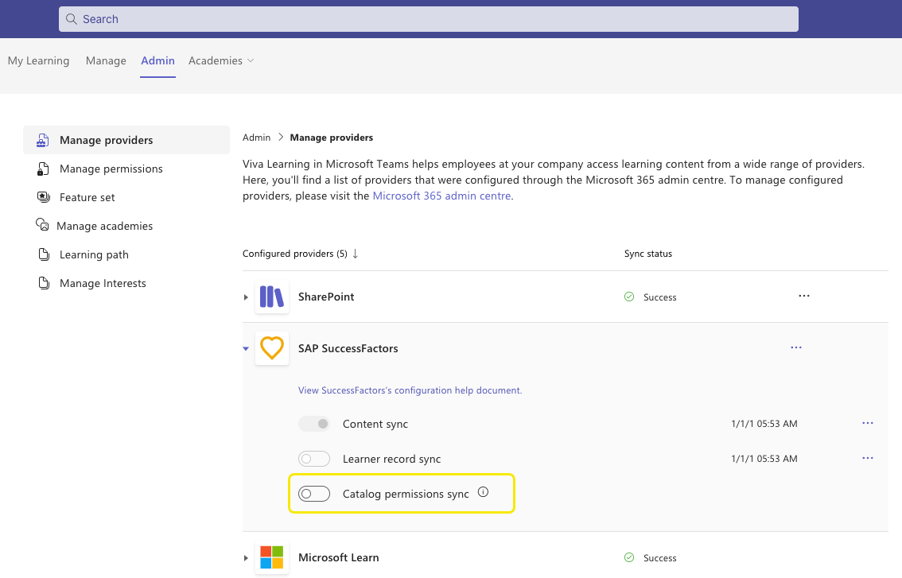

# Manage permissions for SAP SuccessFactors

You can synchronize permissions applied using assignment profile on courses in SuccessFactors within Viva Learning application.  If a user is restricted to a certain course in SuccessFactors, then that user will not be able to view, search, or consume the same course within Viva Learning. This is a one-way sync from SuccessFactors into Viva Learning.

## Pre-requisites for catalog permissions sync

- Viva Suite or Viva Learning license is required to set up SAP SuccessFactors integration with Viva Learning.  
Any Microsoft 365 subscription that has Exchange Online and SharePoint Online will support groups. That includes the Business Essentials and Business Premium plans, and the Enterprise E1, E3, and E5 plan.
- If SAP SuccessFactors is already configured in your Viva Learning application, then you can skip to the next step.
- The Initial sync package generated by SAP SuccessFactors should be available in the configured SFTP folder path. 
- SAP SuccessFactors & Microsoft Entra user sync should be enabled. Enable inbound user provisioning with SAP SuccessFactors to ensure that all users in Microsoft Entra ID have the right employee ID configured. [Prerequisite for learner record sync](/viva/learning/sfsf-enable-learning-record-sync).

## Catalog permissions sync

Use the toggle button to enable or disable the catalog permissions sync from the learning management system to Viva Learning.  

Users from your organization can view, search, and consume only the courses assigned to them through assignment profiles in SAP SuccessFactors.  

By enabling catalog permissions, you allow Viva Learning to fetch user information, user assignment profiles mappings and catalog assignment profile mappings. The user information from the learning management system is only used for user mapping and is not stored.

Note the following considerations:

Once the catalog permissions toggle button is enabled/re-enabled:

- the ingestion of both catalogs and the permissions are triggered. The initial package from the specified SFTP folder path as mentioned earlier will be used for ingestion. It may take up to 24 hours to complete the ingestion.  

- The Viva Learning application will generate M365 groups on behalf of the tenants for internal consumption. These groups are named as VL-GUID. These groups are system generated and shouldn’t be modified by users. 

- Once the catalog permissions toggle button is disabled,  

    - The permissions data from SF  is deleted in Viva Learning. All the users will now be able to search and view all ingested courses from SAP SuccessFactors in Viva Learning.  

    - Re-enabling the catalog permissions would require admins to ensure that all pre-requisites are fulfilled as mentioned in the section above.
