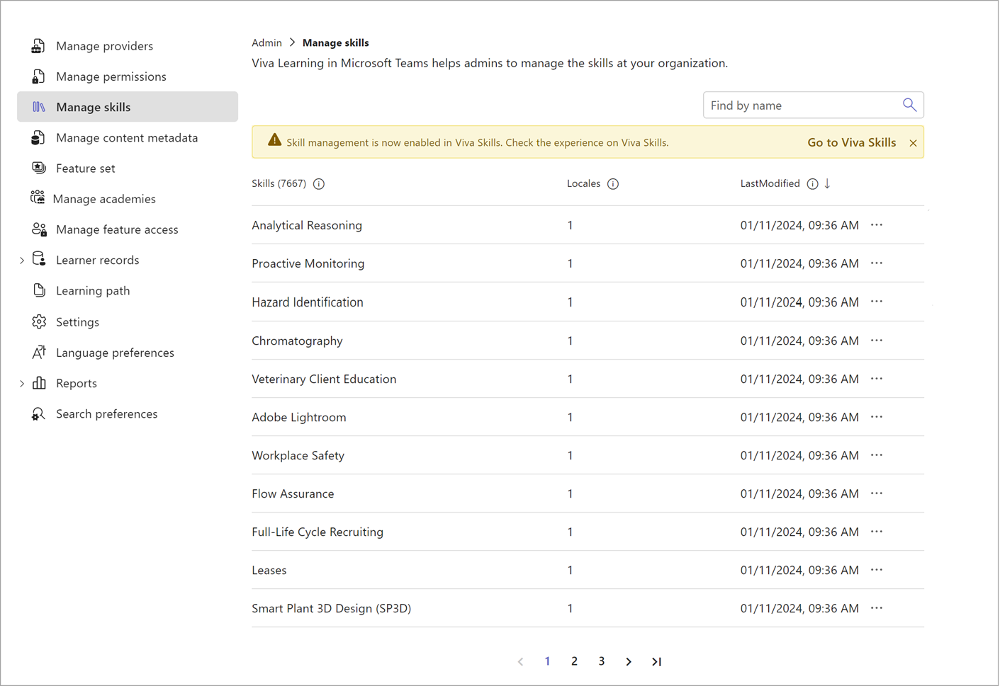
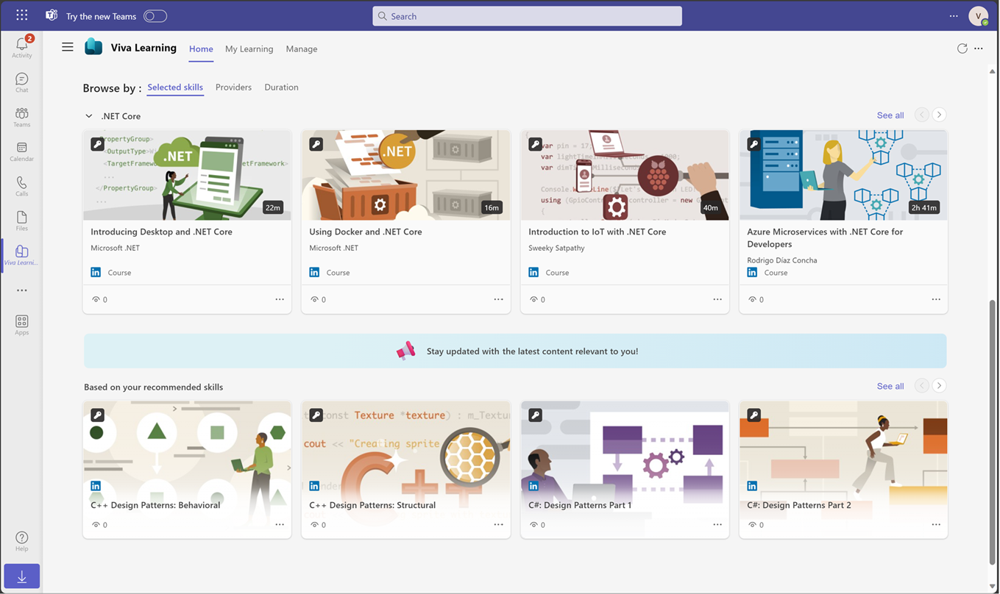
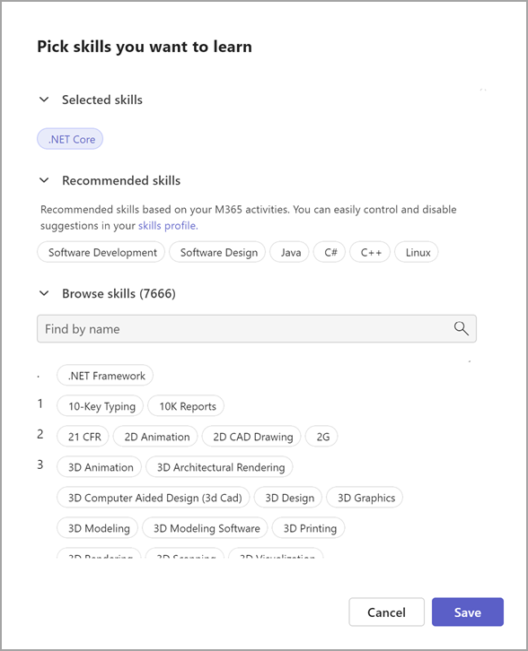
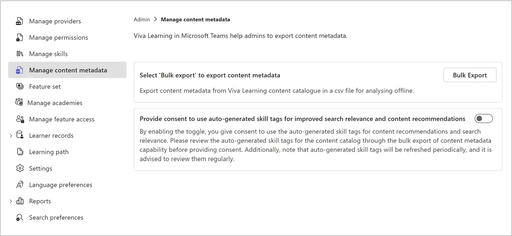

# Skills-based learning in Viva Learning

Use skills-based learning experiences to improve personalization for learners and allow admins to automatically enrich their content metadata.
The following skills-based scenarios are enabled in **private preview** for Viva Learning:

**Learners**

- Personalized course suggestions based on the learner's activities in Microsoft 365. 
- Personalized skill suggestions based on the learner's activities in Microsoft 365 and their role.
- If selected by learners, these skill suggestions provide focused courses. 
- Improved learning content suggestions and search relevance with enriched content metadata through autogenerated tags.

**Admins**

- Skills included in the organization's skills library are incorporated into Viva Learning once the library is published to Viva Learning.
- Admins can export content metadata to review the autogenerated tags for content catalog and use them for content recommendations and search relevance. 
- Admins can view the autogenerated tag for each content through the **Edit** button on content details page. They can review the autogenerated tags and also disable the autogenerated tags for specific content from being used for content recommendations and search relevance.

## Considerations 

For private preview, any "interests" the user selected in Viva Learning are cleared once admins allow skills to appear in Learning. Users lose all associated personalized experiences in Viva Learning when the interests data is no longer available. When setting up or managing their skills library, admins should only select **Allow Skills in Viva Learning** if they're ready to delete existing interest-related content and data in Viva Learning.

Once the skills library is turned on in the Microsoft 365 admin center, this is an interim period before the skills appear in Viva Learning. During this time, Learning doesn't display any skills experiences. 
English is the only supported language for private preview. 

To ensure any existing interests are included as skills when your organization turns on skills in Viva Learning: 

1. Export your organization's current interests in Viva Learning by going to the Viva Learning **Admin** tab > **Manage interests** > **Export**. Download the file when the export is processed. 
2. Go to **Manage skills library** in the Microsoft 365 admin center and follow these steps to import your organization's existing interests as custom skills. Once the import is complete, you need to allow skills in Viva Learning. 

These personalized experiences aren't supported on mobile for private preview. 

## Skills in Viva Learning

These "manage skills" scenarios are available in private preview:

1. When you allow skills to be available in Viva Learning from the skills setup and management experience (Microsoft 365 admin center), the existing **Import** and **Export** buttons are hidden in the Manage Skills view. Learning will then start importing skills from your organization's skills library in the Microsoft 365 admin center to power the app's skills experiences. 

2. Admins can view any skills and skills description with supported languages that are available in their skills library from the skills library from the **Admin** tab in Learning.

3. Admins go to their organization's skills library directly from learning to update and manage the library and settings.

Learn more about [managing the interests](/viva/learning/interests) that are currently available in Viva Learning. 

## Learning and skill suggestions

The following learning scenarios are available in private preview:

1. Personalized learning suggestions on the Viva Learning home page based on a user's activities in Microsoft 365. The course suggestions appear in the "based on your recommended skills" section on the Viva Learning home page. 

1. Viewing the set of recommended skills suggestions based on their Microsoft 365 activity and role from the "Pick skills you want to learn" modal. 

1. Choosing a recommended skill provides the user with personalized learning courses on that topic. 

Learn more about managing the [interests currently available](https://support.microsoft.com/en-au/office/personalize-your-learning-with-viva-learning-ca774f08-6bed-441b-a74b-3aac15cd9019) in Viva Learning.

- Learners can browse all the skills available in their organization alphabetically and can search for specific skills.

- Once learners find a subject they’d like to upskill or reskill in, they can select that skill to receive personalized course content. They can also remove or deselect current skills to stop receiving content on the subject. 

- Search results can be filtered based on the skills a learner has currently selected.

- Skills in Viva Learning will be displayed in the language that organizations set for their users in the Teams app or at the tenant level. 

## Using autogenerated skills tags 

Any tags that were manually added to content prior to the current private preview will be lost.
Both auto and manual content tagging are supported only for English language in the current preview. 

The following content tagging scenarios enabled for admins in the private preview:

- Admins can export content metadata to review the autogenerated tags for the content catalog. Admins can also provide consent to use autogenerated tags for improved search relevance and content recommendations. 

- Admins can View the autogenerated tag for each content using the **Edit** button on the Content details page to either review autogenerated tags or disable ones that aren't relevant.

Learners can view enhanced content recommendations and enhanced search relevance through autogenerated tags. 

For more information, read the Viva Learning documentation on [content tagging and metadata export](/viva/learning/content-tagging).